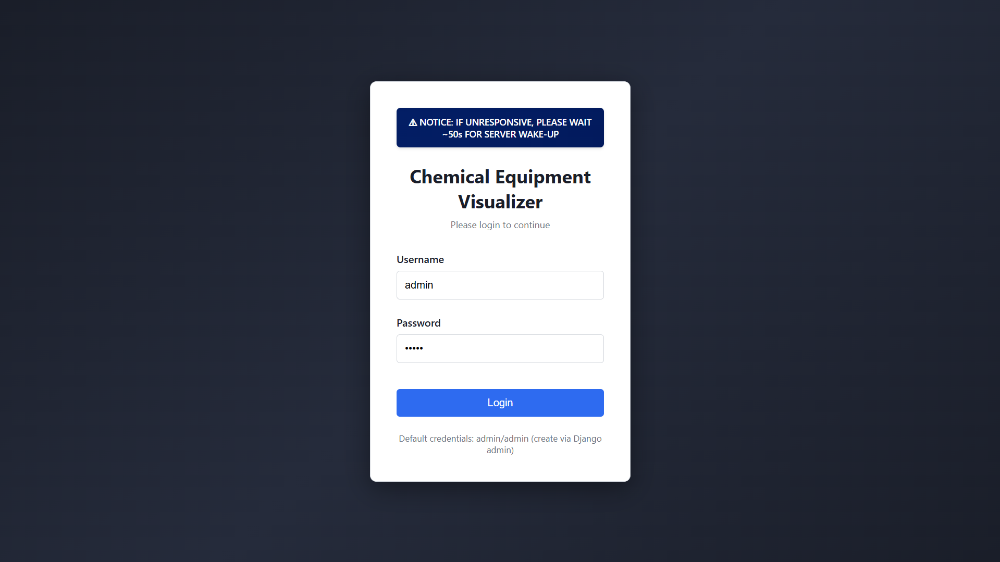
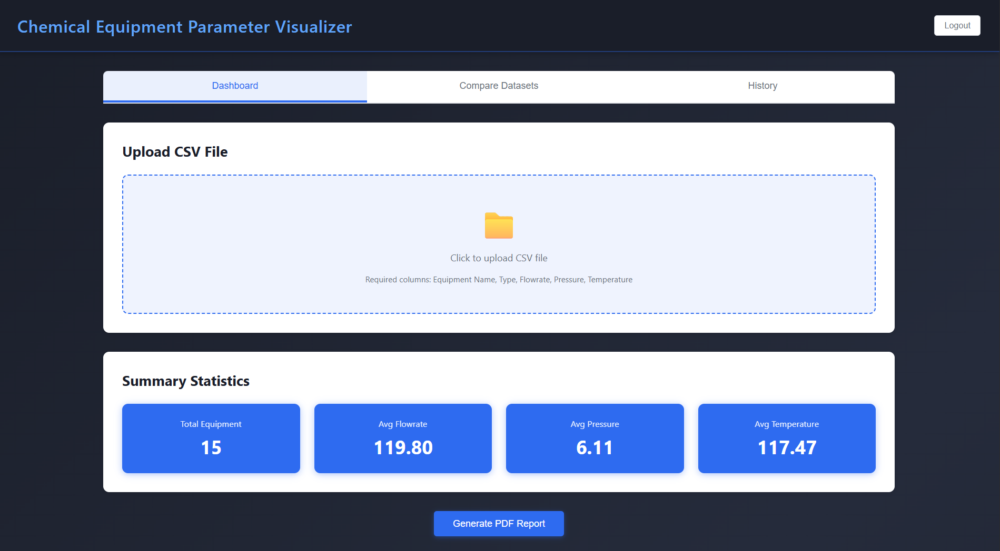
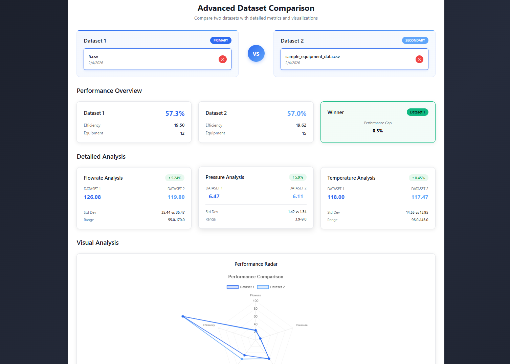
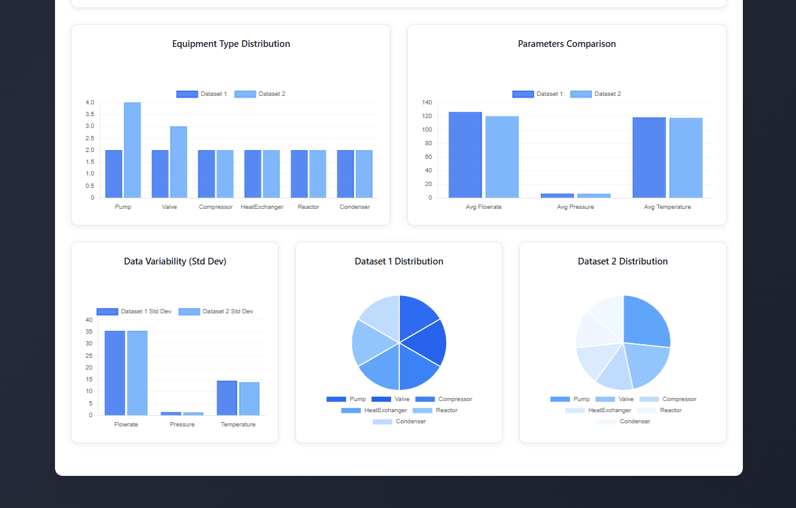
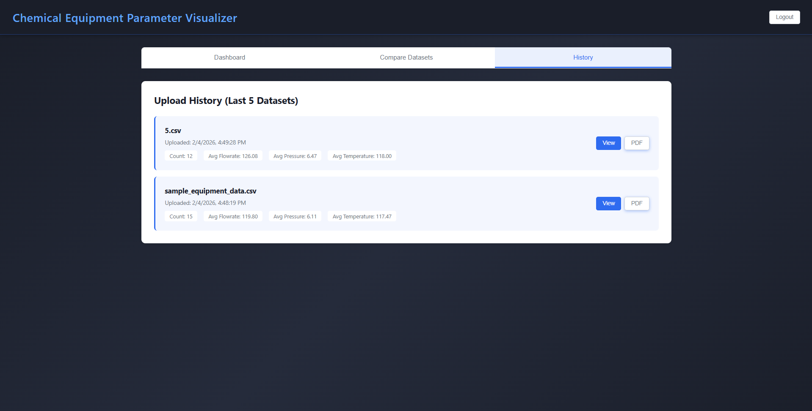

# Chemical Equipment Parameter Visualizer  
**Hybrid Web + Desktop Application**

A hybrid **Web and Desktop application** for uploading, analyzing, and visualizing chemical equipment data.  
The system uses a **shared Django REST backend**, with:
- **React + Chart.js** for the web frontend
- **PyQt5 + Matplotlib** for the desktop frontend

---

## Project Structure

```text
chemical-equipment-visualizer/
├── backend/                    # Django REST API backend
│   ├── chemical_equipment/     # Django project settings
│   ├── equipment/              # App: models, views, serializers
│   ├── manage.py
│   └── requirements.txt
├── frontend-web/               # React web application
│   ├── src/
│   ├── public/
│   ├── package.json
│   └── package-lock.json
├── frontend-desktop/           # PyQt5 desktop application
│   ├── main.py
│   └── requirements.txt
├── sample_equipment_data.csv   # Sample CSV for testing
└── README.md
```

## Features

**CSV Upload** - Upload CSV files via web or desktop interface  
**Data Summary API** - Get total count, averages, and equipment type distribution  
**Data Visualization** - Charts using Chart.js (web) and Matplotlib (desktop)  
**History Management** - Store and view last 5 uploaded datasets  
**PDF Report Generation** - Generate comprehensive PDF reports  
**Basic Authentication** - Secure access with username/password  
**Dataset Comparison** - Compare two datasets side-by-side with detailed metrics  
**Enhanced Charts** - Improved visualizations with consistent color schemes  
**Paginated Data Table** - Clean data display with pagination for large datasets  

## Project Gallery

A comprehensive view of the system's capabilities.

<table width="100%" style="border-collapse: separate; border-spacing: 10px;">
  <tr>
    <td width="33%" align="center" style="border: 2px solid #848484ff; padding: 10px;">
      
      <br />
      <strong>Authentication</strong>
    </td>
    <td width="33%" align="center" style="border: 2px solid #848484ff; padding: 10px;">
      
      <br />
      <strong>Dashboard</strong>
    </td>
    <td width="33%" align="center" style="border: 2px solid #848484ff; padding: 10px;">
      
      <br />
      <strong>Data Analytics</strong>
    </td>
  </tr>
  <tr>
    <td width="33%" align="center" style="border: 2px solid #848484ff; padding: 10px;">
      
      <br />
      <strong>Dataset Comparison</strong>
    </td>
    <td width="33%" align="center" style="border: 2px solid #848484ff; padding: 10px;">
      
      <br />
      <strong>Comparison Analytics</strong>
    </td>
    <td width="33%" align="center" style="border: 2px solid #848484ff; padding: 10px;">
      
      <br />
      <strong>Upload History</strong>
    </td>
  </tr>
</table>

---

## Tech Stack

- **Backend**: Python Django + Django REST Framework
- **Frontend Web**: React.js + Chart.js
- **Frontend Desktop**: PyQt5 + Matplotlib
- **Data Handling**: Pandas
- **Database**: SQLite
- **PDF Generation**: ReportLab

## Prerequisites

- **Python**: 3.10.x (recommended: 3.10.11)
- **Node.js**: 18+
- **npm**
- **Git**

## Setup Instructions

### 1. Backend Setup (Django)

```bash
# Navigate to backend directory
cd backend

# Create virtual environment (recommended)
python -m venv venv

# Activate virtual environment
# On Windows:
venv\Scripts\activate
# On Linux/Mac:
source venv/bin/activate

# Install remaining dependencies
pip install -r requirements.txt

# Create environment file from template
cp .env.example .env
# Edit .env with your configuration (optional for development)

# Run migrations
python manage.py migrate

# Create superuser (for authentication)
python manage.py createsuperuser
# Follow prompts to create admin user (e.g., username: admin, password: admin)

# Start Django development server
python manage.py runserver
```

The backend will be running at `http://localhost:8000`

**Note**: Use the superuser credentials you created for login in both web and desktop applications.

### 2. Web Frontend Setup (React)

Open a new terminal:

```bash
# Navigate to frontend-web directory
cd frontend-web

# Install dependencies
npm install

# Start development server
npm start
```

The web application will open at `http://localhost:3000`

### 3. Environment Setup (Frontend Web)

Create a `.env` file inside `frontend-web` directory:

```env
REACT_APP_API_BASE_URL=http://localhost:8000/api
```

### 4. Desktop Frontend Setup (PyQt5)

Open a new terminal:

```bash
# Navigate to frontend-desktop directory
cd frontend-desktop

# Create virtual environment (if not using the backend one)
python -m venv venv
venv\Scripts\activate  # Windows
# or
source venv/bin/activate  # Linux/Mac

# Install dependencies
pip install -r requirements.txt

# Run desktop application
python main.py
```

## Usage

### Web Application

1. Open `http://localhost:3000` in your browser
2. Login with your Django superuser credentials
3. Click "Select CSV File" to upload a CSV file
4. View summary statistics, charts, and data table
5. Click "Generate PDF Report" to download a PDF
6. View upload history in the History tab
7. Use the Comparison tab to compare two datasets side-by-side

### Desktop Application

1. Run `python main.py` from the `frontend-desktop` directory
2. Login with your Django superuser credentials
3. Click "Select CSV File" to upload a CSV file
4. View summary statistics, charts, and data table in tabs
5. Click "Generate PDF Report" to save a PDF
6. View upload history in the History tab
7. Use the Compare Datasets tab for detailed dataset comparisons

### CSV File Format

The CSV file must contain the following columns:
- `Equipment Name`
- `Type`
- `Flowrate`
- `Pressure`
- `Temperature`

Example:
```csv
Equipment Name,Type,Flowrate,Pressure,Temperature
Reactor R-101,Reactor,150.5,25.3,180.2
Distillation Column D-201,Distillation,320.8,15.7,95.5
```

A sample CSV file (`__sample_equipment_data.csv`) is provided in the root directory for testing.

## Backend API Endpoints

All endpoints require Basic Authentication and are served by the Django backend at `http://localhost:8000`.

**Base URL**: `http://localhost:8000/api/`

- `POST /api/upload/` - Upload CSV file
- `GET /api/summary/` - Get summary statistics (latest dataset)
- `GET /api/summary/<dataset_id>/` - Get summary for specific dataset
- `GET /api/data/` - Get equipment data (latest dataset)
- `GET /api/data/<dataset_id>/` - Get equipment data for specific dataset
- `GET /api/history/` - Get upload history (last 5 datasets)
- `GET /api/pdf/` - Generate PDF report (latest dataset)
- `GET /api/pdf/<dataset_id>/` - Generate PDF for specific dataset

**Note**: These are Django REST Framework API endpoints. Both the React web frontend and PyQt5 desktop frontend consume these same endpoints.

## Testing

1. Use the provided `__sample_equipment_data.csv` file for testing
2. Upload it via either web or desktop interface
3. Verify that:
   - Summary statistics are displayed correctly
   - Charts render properly
   - Data table shows all equipment
   - PDF can be generated
   - History shows the uploaded dataset

## Troubleshooting

### Backend Issues

- **Port 8000 already in use**: Change port with `python manage.py runserver 8001`
- **Migration errors**: Run `python manage.py makemigrations` then `python manage.py migrate`
- **Authentication fails**: Ensure you've created a superuser with `python manage.py createsuperuser`

### Web Frontend Issues

- **Port 3000 already in use**: React will prompt to use another port
- **CORS errors**: Ensure Django CORS settings allow `http://localhost:3000`
- **API connection fails**: Verify backend is running on `http://localhost:8000`

### Desktop Frontend Issues

- **PyQt5 installation fails**: On Linux, you may need: `sudo apt-get install python3-pyqt5`
- **Matplotlib display issues**: Ensure display server is running (X11 on Linux)
- **Connection errors**: Verify backend is running and accessible

## Development Notes

- The application maintains only the last 5 uploaded datasets in the database
- All API endpoints require Basic Authentication
- PDF reports include summary statistics, type distribution, and full equipment data
- Both frontends consume the same Django REST API
- Environment variables are used for secure configuration management
- `.env.example` provides template for required environment variables
- Never commit `.env` file to version control

## Submission Checklist

- ✅ Source code on GitHub
- ✅ README with setup instructions
- ✅ Sample CSV file included
- ✅ Both web and desktop frontends functional
- ✅ All required features implemented
